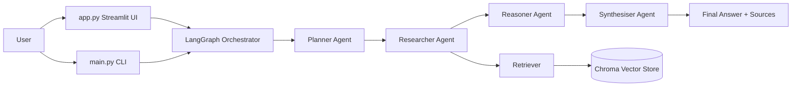
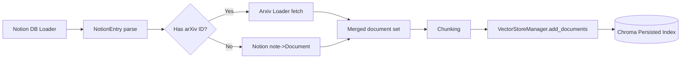

# Notion Agentic RAG Architecture

## 1. System Overview

This repository implements a multi-agent RAG system with two primary runtime paths:

- **Ingestion path**: Notion/arXiv content is loaded, transformed, chunked, and indexed into Chroma.
- **Query path**: A LangGraph orchestrator runs four agents in sequence to produce a cited answer.

Core implementation lives under `src/`:

- `src/orchestrator/` for graph + shared state
- `src/agents/` for planner/researcher/reasoner/synthesiser
- `src/rag/` for embeddings, vector store, retriever, splitting utilities
- `src/loaders/` for Notion + arXiv ingestion
- `src/tools/` for A2A-style tool agent framework

## 2. High-Level Topology

## 3. Orchestrator Design

**Module**: `src/orchestrator/graph.py`  
**State contract**: `src/orchestrator/state.py`

The orchestrator uses `StateGraph(AgentState)` with a **linear workflow**:

1. `planner`
2. `researcher`
3. `reasoner`
4. `synthesiser`
5. `END`

`AgentState` is the shared data contract across nodes:

- Input: `query`
- Planning: `sub_tasks`, `planning_reasoning`
- Retrieval: `retrieved_docs`, `retrieval_metadata`
- Analysis: `analysis`, `overall_assessment`
- Output: `final_answer`, `sources`
- Optional tool envelope: `tool_results`
- Execution status: `error`, `current_agent`

## 4. Agent Responsibilities

### Planner (`src/agents/planner.py`)
- Uses Cohere chat model via `get_agent_llm("planner")`
- Produces structured JSON (`reasoning` + `sub_tasks`)
- Sub-tasks include `id`, `task`, `priority`, `keywords`

### Researcher (`src/agents/researcher.py`)
- Reformulates each sub-task into optimized retrieval queries
- Uses `get_retriever(use_rerank=True)`
- Retrieves from vector store, deduplicates by document content hash
- Annotates retrieved docs with `retrieval_task_id` and `retrieval_query`

### Reasoner (`src/agents/reasoner.py`)
- Consumes sub-tasks + retrieved docs
- Produces per-task analysis with findings/evidence/contradictions/gaps/confidence
- Returns `analysis` + `overall_assessment`

### Synthesiser (`src/agents/synthesiser.py`)
- Produces final markdown answer with citation instructions
- Builds normalized source objects from retrieved document metadata
- Deduplicates sources and returns `final_answer` + `sources`

## 5. RAG Subsystem

### Embeddings (`src/rag/embeddings.py`)
- Cohere `embed-english-v3.0`

### Vector Store (`src/rag/vectorstore.py`)
- Chroma persistent collection (path from settings)
- Sanitizes metadata for Chroma compatibility
- Supports batched writes with delay controls

### Retriever (`src/rag/retriever.py`)
- Base retriever from Chroma (`k = settings.retrieval_k`)
- Optional reranking via `CohereRerank`
- Falls back to base retriever if reranker init fails

### Text Processing (`src/rag/text_processing.py`)
- Recursive chunking defaults
- Markdown-aware splitting path for Notion-style content

## 6. Ingestion Data Flow

**Entry point**: `src/ingest.py`  
**Pipeline**: `src/loaders/pipeline.py`

Key behavior:
- Notion metadata is the primary catalog.
- arXiv documents are enriched with Notion metadata.
- Final chunked docs are embedded and persisted to Chroma.

## 7. Tool Agent Subsystem (A2A-style)

**Modules**: `src/tools/base.py`, `src/tools/registry.py`, `src/tools/client.py`, individual tool files

Implemented capabilities:
- Web search
- Code execution (sandboxed subprocess with restricted imports)
- Citation validation (arXiv)
- Math solving (SymPy)
- Diagram generation (Mermaid syntax)

Design pattern:
- Tool agents expose an `AgentCard` and async `execute()`
- `ToolRegistry` supports discovery + health checks
- `A2AToolClient` supports discovery, best-agent selection, timeout-wrapped invocation

Current boundary:
- `AgentState` includes `tool_results`, and tool infrastructure is present.
- The main LangGraph node chain currently does **not** invoke the tool client directly.

## 8. Entry Points and Runtime Modes

- `main.py`: CLI query execution, ingestion trigger, and connection tests
- `app.py`: Streamlit chat UI, streaming graph events, source rendering, session persistence
- `src/ingest.py`: batch ingestion into vector store

## 9. Cross-Cutting Concerns

- **Configuration**: `config/settings.py` (Pydantic settings, model and retrieval parameters, tool toggles)
- **Tracing**: `src/utils/tracing.py` (`agent_trace` decorator + LangSmith env setup)
- **Session persistence (UI)**: `src/utils/session_manager.py` (`data/sessions/*.json`)

## 10. Current Architectural Constraints

- Orchestration is intentionally linear (no retry/loopback edges yet).
- Retrieval and generation are tightly coupled to Cohere models/APIs.
- Tool-agent framework exists as an extensibility surface, pending full orchestration integration.
