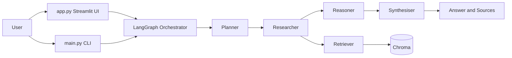

# Notion Agentic RAG Architecture

## System Overview

The repository has two runtime paths:

- Ingestion path: Notion and arXiv content is loaded, normalized, chunked, and indexed in Chroma.
- Query path: LangGraph orchestrates Planner, Researcher, Reasoner, and Synthesiser to produce a cited response.

Core implementation:

- `src/orchestrator/` for graph and shared state
- `src/agents/` for the core four agents
- `src/rag/` for embeddings, vector store, retrieval, and chunking
- `src/loaders/` for Notion and arXiv ingestion
- `src/tools/` for A2A-style tool agents

## High-Level Topology

## Orchestrator and State Contract

- Graph: `src/orchestrator/graph.py`
- State: `src/orchestrator/state.py`

Execution order is linear:

1. `planner`
2. `researcher`
3. `reasoner`
4. `synthesiser`
5. `END`

Key `AgentState` envelopes:

- Input: `query`
- Planning: `sub_tasks`, `planning_reasoning`
- Retrieval: `retrieved_docs`, `retrieval_metadata`
- Analysis: `analysis`, `overall_assessment`
- Output: `final_answer`, `sources`
- Optional tools: `tool_results`
- Status: `error`, `current_agent`

## Agent Responsibilities

- Planner: decomposes query into structured sub-tasks.
- Researcher: retrieves and reranks evidence, then deduplicates.
- Reasoner: analyzes evidence by sub-task with confidence and gap tracking.
- Synthesiser: produces final answer and normalized citations.

## Ingestion and Retrieval Path

Entry points:

- `src/ingest.py`
- `src/loaders/pipeline.py`

Flow:

- Notion loader extracts catalog metadata.
- arXiv loader fetches full paper text when IDs exist.
- Pipeline merges metadata and content.
- Text processing chunks documents.
- Vector store manager persists embeddings to Chroma.

## Tool Agent Subsystem

Implemented framework:

- `src/tools/base.py`
- `src/tools/registry.py`
- `src/tools/client.py`

Implemented tool capabilities:

- web search
- code execution (sandboxed subprocess)
- citation validation
- symbolic math solving
- diagram generation

Current boundary:

- Tool framework and state envelope are implemented.
- Core graph remains linear and invokes tools from agent logic when needed.

## Cross-Cutting Concerns

- Configuration: `config/settings.py`
- Tracing: `src/utils/tracing.py` and `docs/utils/tracing.md`
- Session persistence: `src/utils/session_manager.py` and `docs/utils/session_manager.md`

## Related Docs

- Data model and invariants: `docs/database.md`
- Engineering patterns: `docs/patterns.md`
- Testing policy: `docs/testing.md`
- Operational commands: `docs/commands.md`
